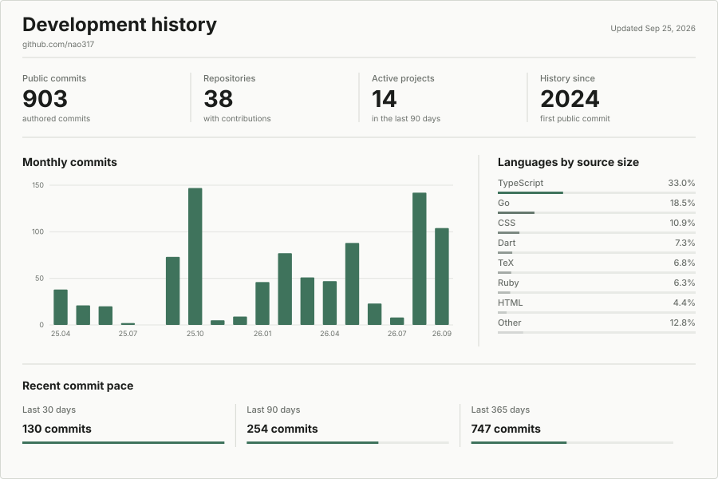

<h1 align="center">Nao Okumura</h1>

  Student at Kyushu Institute of Technology 
  Building web applications, proof-of-concept systems, and hackathon projects

<picture>
  <source media="(prefers-color-scheme: dark) and (max-width: 600px)" srcset="./assets/development-dashboard-mobile-dark.svg">
  <source media="(prefers-color-scheme: dark)" srcset="./assets/development-dashboard-dark.svg">
  <source media="(max-width: 600px)" srcset="./assets/development-dashboard-mobile.svg">
  
</picture>

Dashboard data is generated from public GitHub activity and refreshed every six hours by GitHub Actions. Language percentages are based on source bytes in repositories with public contributions.

